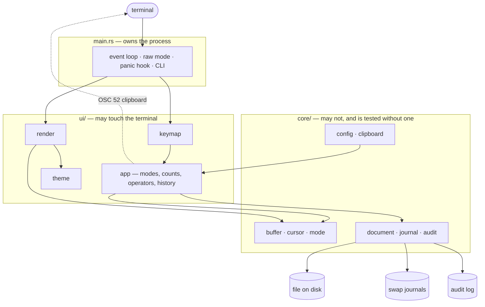
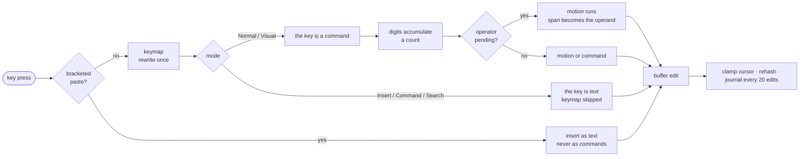
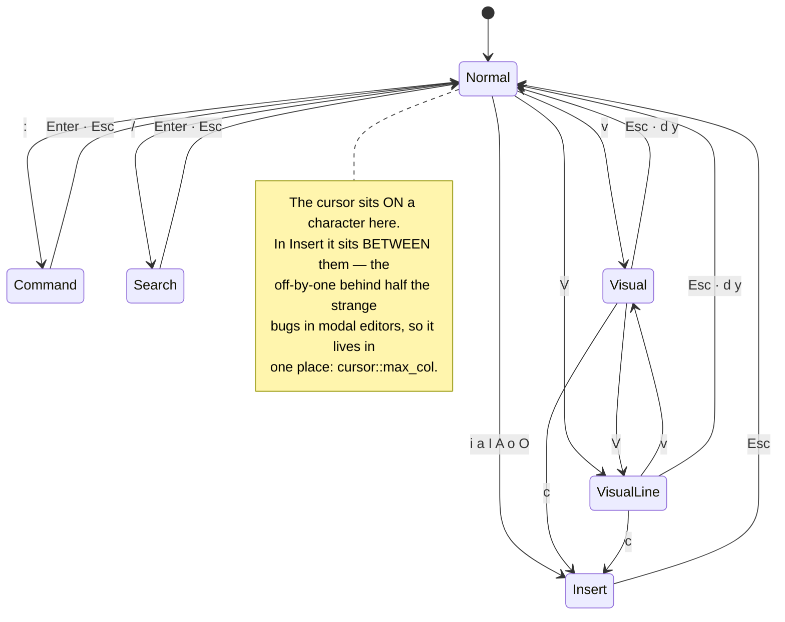
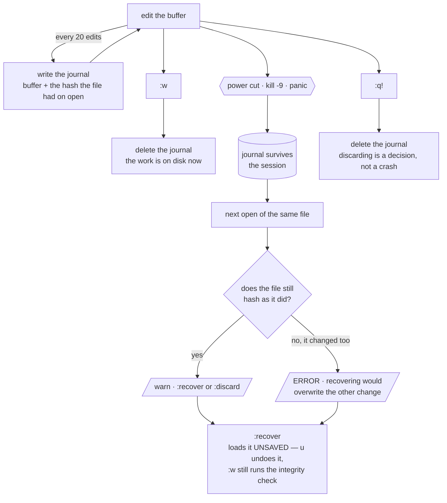

<div align="center">

# MAAT

**A retro modal terminal editor with integrity awareness.**

*As above, so below — the buffer and the disk must agree.*


</div>

## At a glance

|  |  |
| --- | --- |
| **What it is** | A modal terminal editor, Vim-shaped, that knows whether the file underneath it changed while you were editing. |
| **The one idea** | Opening a file records its SHA-256. Before writing, maat hashes the file again. If it no longer matches, it warns instead of silently overwriting whatever the other party wrote. |
| **Built with** | Rust · `ratatui` · `crossterm` · `sha2` — four crates, on purpose |
| **Size** | ~6 300 lines · **188 tests** · a 906 KB static musl binary |
| **Editing** | Modal (Normal / Insert / Command / Search / Visual) · counts · operators composed with motions · literal `:s` substitution · undo & redo · multiple buffers with a file picker |
| **Integrity** | Atomic saves · external-change detection · crash-recovery journal · audit events in JSON or CEF · `--verify` for scripts |
| **Made for** | Appliance consoles, shared servers and config files — anywhere a blind overwrite destroys someone else's change, or an attacker's tracks |
| **Run it** | `cargo run -- notes.txt` |

**Contents** — [Architecture](#architecture) · [Quick start](#quick-start) ·
[Key map](#key-map) · [Command line](#command-line) ·
[Integrity model](#integrity-model) · [Crash recovery](#crash-recovery) ·
[Configuration](#configuration) · [Audit trail](#audit-trail) ·
[Roadmap](#roadmap)

---

## Architecture

Three layers, and the rule that keeps them apart: **`core/` never imports
`ratatui` or `crossterm`.** That is what lets the whole domain — text, cursor,
file integrity, recovery — be unit-tested without ever standing up a terminal,
and it is why 188 tests run in under a tenth of a second.



| Module | Responsibility | Lines |
| --- | --- | --- |
| `core/buffer` | Lines of text, addressed in **characters** — slicing `café` by byte is how an editor corrupts a file | 354 |
| `core/cursor` | Every motion clamps against the buffer, so an out-of-range cursor is unrepresentable | 139 |
| `core/mode` | The five modes as an enum, so the compiler forces every input state to be handled | 72 |
| `core/document` | Atomic writes, SHA-256 disk state, CRLF/LF preservation | 515 |
| `core/journal` | Mirrors unsaved work so a crash costs keystrokes, not a session | 271 |
| `core/audit` | One structured event per save, for a SIEM | 156 |
| `core/config` | A deliberate TOML subset, hand-parsed to keep the dependency tree at four | 339 |
| `core/clipboard` | OSC 52 — the terminal's clipboard, which works over SSH | 109 |
| `ui/app` | Modes, counts, operators, registers, history, search, commands | 3 116 |
| `ui/keymap` | Rewrites a key into the key the editor understands | 208 |
| `ui/render` | Gutter, selection, search highlighting, status bar, overlays | 609 |
| `ui/theme` | The Oxblood palette, degrading to 16 colours | 229 |
| `main` | Terminal lifecycle, event loop, panic hook, CLI | 213 |

### What happens to a keystroke

Every key takes the same path, and each stage only knows about the one before
it. That is why a rebound key, a count and an operator compose without any of
them knowing the others exist.



### The modes



---

### Source layout

```text
src/
├── main.rs          terminal lifecycle, event loop, CLI (--verify, --help)
├── core/
│   ├── audit.rs     structured save events (JSON / CEF)
│   ├── buffer.rs    UTF-8-safe line buffer
│   ├── cursor.rs    mode-aware cursor invariants
│   ├── mode.rs      Normal / Insert / Command / Search / Visual
│   └── document.rs  atomic file I/O and SHA-256 disk-state checks
└── ui/
    ├── app.rs       editor state, history, search and key handling
    ├── render.rs    buffer, overlays, welcome and status line
    └── theme.rs     Oxblood palette with 16-colour degradation
```

---

## Quick start


```bash
git clone https://github.com/Zoel-Manchon/maat.git
cd maat
cargo run -- demo/sample.txt
```

Install the binary locally:

```bash
cargo install --path .
maat notes.txt
```

Create a new document without a path:

```bash
maat
```

Then save it from Command mode:

```vim
:w notes/first-draft.txt
```

The destination directory must already exist.

---

## Key map


### Normal mode

| Keys | Action |
|---|---|
| `h j k l` / arrows | Move cursor |
| `w` / `b` | Next / previous word |
| `0` / `$` | Start / end of line |
| `gg` / `G` | Start / end of buffer |
| `i a I A` | Enter Insert mode |
| `o` / `O` | Open line below / above |
| `x` | Delete character |
| `dd` / `yy` / `cc` | Delete / copy / change the whole line |
| `d` `y` `c` + motion | `dw` `c3w` `d$` `d0` `dG` `dgg` `yw` |
| `p` / `P` | Paste below / above |
| `u` / `Ctrl-r` | Undo / redo |
| `/` | Search |
| `n` / `N` | Next / previous result |
| `?` | Toggle quick reference |
| `:` | Enter Command mode |
| `v` / `V` | Visual mode, character-wise / line-wise |
| `3j` `5x` `2dd` | A count applies to any motion or operator |
| `12G` | Jump to line 12 |
| `Ctrl-p` | Open the file picker |

### Visual mode

| Keys | Action |
|---|---|
| `v` / `V` | Start a character-wise / line-wise selection |
| motions | Extend the selection; counts work here too |
| `o` | Jump to the other end of the selection |
| `d` / `x` | Delete the selection (and yank it) |
| `y` | Yank the selection |
| `c` | Delete the selection and enter Insert mode |
| `p` | Replace the selection with the register |
| `Esc` | Leave without touching anything |

### Commands

| Command | Action |
|---|---|
| `:w` | Save |
| `:w <path>` | Save as |
| `:w!` | Force save after an integrity warning |
| `:q` / `:q!` | Quit / discard changes |
| `:wq` / `:x` | Save and quit |
| `:e <path>` | Open a file in a new buffer, or jump to it if already open |
| `:bn` / `:bp` | Next / previous buffer, wrapping |
| `:bd` / `:bd!` | Close this buffer / discard its unsaved changes |
| `:ls` | List open buffers on the message line |
| `:buffers` | Pick from the open buffers |
| `:find` | Pick a file from below the working directory |
| `:s/old/new/` | Replace the first match on the current line |
| `:s/old/new/g` | Replace every match on the current line |
| `:%s/old/new/g` | Replace every match in the file |
| `:hash` | Show full buffer SHA-256 |
| `:check` | Compare the file with the last known disk state |
| `:info` | Show path, lines, words, characters and line ending |
| `:recover` | Load unsaved work left by an interrupted session |
| `:discard` | Throw that journal away |
| `:set relativenumber` | Enable relative line numbers |
| `:set number` | Restore absolute line numbers |
| `:set clipboard` | Mirror yanks to the terminal clipboard (OSC 52) |
| `:set noclipboard` | Keep yanks in the editor's register only |
| `:help` | Open the quick reference |

---

## What it does

- Normal, Insert, Command, Search and Visual modes.
- Vim-inspired motions: `hjkl`, `w`, `b`, `0`, `$`, `gg`, `G`, `12G`.
- Counts before any motion or operator: `3j`, `5x`, `2dd`, `3p`.
- Operators compose with motions: `dw`, `c3w`, `d$`, `d0`, `dG`, `dgg`, `yw`.
- Visual selection: `v` character-wise, `V` line-wise, with `d`, `y`, `c`, `p`.
- Literal substitution: `:s/old/new/`, `/g`, and `:%s` for the whole file.
- Incremental `/search`, highlighted matches and `n` / `N` navigation.
- Undo with `u` and redo with `Ctrl-r`.
- Register that remembers whether it holds lines or a character span.
- CRLF and LF line endings preserved exactly as the file had them.
- Bracketed paste: a pasted block is inserted as text, never run as commands.
- System clipboard over **OSC 52** — works through SSH, needs no display server.
- **Multiple buffers** with per-buffer cursor, scroll and undo history.
- **File picker** (`Ctrl-p`) and buffer picker, filtered by substring as you type.
- External-change detection before save; explicit `:w!` override.
- Live SHA-256 fingerprint and `:check` integrity command.
- Integrated `?` help panel and a branded welcome screen.
- Absolute or relative line numbers.
- UTF-8-safe editing and horizontal/vertical scrolling.
- **Atomic saves**: a crash mid-write can never leave a half-written file.
- **Audit events** (JSON or CEF) appended on every save, for SIEM ingestion.
- **`--verify`**: non-interactive integrity check for scripts and boot-time use.
- **Exit code 2** on an abandoned edit, so `visudo` and `crontab -e` behave.
- 16-colour fallback for appliance consoles without true colour.
- **Oxblood** visual system: ink, wine and bone — no green-phosphor cliché.

---

## Command line


```bash
maat FILE              # edit a file
maat                   # start an empty buffer
maat --verify FILE     # print SHA-256 and disk state, then exit
maat --help            # usage
maat --version         # version
```

`--verify` prints in `sha256sum` format so it composes with other tools — an
appliance can call the same binary from a boot script to check a config file
without ever starting a UI:

```console
$ maat --verify /etc/emberwall/gateway.conf
9f2c…  /etc/emberwall/gateway.conf
state: unchanged
```

| Exit code | Meaning |
|---|---|
| `0` | Clean exit |
| `1` | An error occurred |
| `2` | The edit was abandoned with unsaved changes (`:q!`) |

Exit code `2` is what makes Maat safe as `$EDITOR`: `visudo` and `crontab -e`
read it to know they must not install a half-edited file.

---

## Integrity model


Maat does not claim to be a forensic tool. It provides a focused safety
barrier against accidental blind overwrites and makes external changes visible
at the moment they matter.

---

## Crash recovery


Atomic saves guarantee a crash cannot leave a half-written *file*. They say
nothing about the twenty minutes of editing that only ever existed in memory.
So maat mirrors unsaved work to a journal under `$XDG_STATE_HOME/maat/swap`
(`$MAAT_STATE` overrides it), and deletes it the moment the work is on disk.



A journal that outlives its session is therefore a statement: this buffer had
unsaved changes when the editor stopped. The next time you open the file, maat
says so and waits:

```console
unsaved changes from an interrupted session — :recover to load them, :discard to drop them
```

`:recover` loads the work back into the buffer and leaves it **unsaved** — the
file on disk is untouched, `u` undoes the recovery, and writing it out is still
a `:w` you type, with the usual integrity check in the way. If the file also
changed on disk since the journal was taken, the warning is louder: restoring
would otherwise silently overwrite whatever the other party wrote, which is the
exact failure this editor exists to prevent.

It is not a lock file. maat will not stop a second editor from opening the same
path: a stale lock on an appliance turns a recoverable situation into one that
needs someone who knows to go and delete a file.

---

## Configuration


maat reads an optional `config.toml` at startup — from `$MAAT_CONFIG`, else
`$XDG_CONFIG_HOME/maat/config.toml`, else `~/.config/maat/config.toml`
(`%APPDATA%\maat\config.toml` on Windows). A missing file is not an error: an
appliance with a read-only root has to boot without one.

```toml
[display]
relativenumber = false
tabwidth       = 4
expandtabs     = false
force16colour  = false   # skip COLORTERM detection

[editor]
clipboard    = false     # mirror yanks to the terminal clipboard (OSC 52)
historylimit = 512
```

The parser handles a deliberate subset of TOML — comments, bare keys, `[table]`
headers, and string, boolean and integer values. That is a choice, not a
shortcut: `toml` + `serde` would roughly quadruple a three-crate dependency
tree in a binary whose point is being small enough to ship inside an appliance
image. A line maat does not understand is reported on the message line when the
editor opens, so a typo in a key name is visible immediately instead of
silently doing nothing.

The full annotated example lives in
[`docs/config.example.toml`](docs/config.example.toml).

---

## Audit trail


Editing a config file on a hardened host is a security-relevant act. Set
`MAAT_AUDIT_LOG` and every save appends one machine-readable line:

```bash
export MAAT_AUDIT_LOG=/var/log/maat-audit.log
export MAAT_AUDIT_FORMAT=cef        # optional; defaults to json
```

```json
{"tool":"maat","event":"save","ts":1770000000,"user":"zoel","path":"/etc/gateway.conf","lines":42,"sha256_before":"9f2c…","sha256_after":"a41b…"}
```

Both formats match [`phosphor`](https://github.com/Zoel-Manchon/phosphor)'s
exports, so a single collector ingests events from both tools. Audit failures
are silent by design: an unwritable log must never cost you your edit.

---

## Why Maat?


Maat is a small Vim-inspired editor built with Rust, `ratatui` and
`crossterm`. Its defining feature is **integrity-aware saving**.

When Maat opens a file, it stores a SHA-256 fingerprint of the contents.
Before writing, it checks the file again. If another process changed or deleted
it while the editor was open, Maat warns instead of silently overwriting that
state.

This makes the project especially relevant for shared servers, appliances,
configuration files and security-oriented workflows.

### The name

**Ma'at** is the ancient Egyptian principle of truth and order. Her feather was
weighed against the heart to judge whether a record was true — which is exactly
what this editor does before every write: it weighs what you have against what
is actually on disk.

The tagline comes from the second hermetic principle, Correspondence: *as above,
so below*. The buffer in memory is "above", the file on disk is "below", and an
editor's job is to keep them in correspondence — or to say so loudly when they
stop being.

---

## Visual identity


The recommended terminal font is **Departure Mono**. Since Maat is a TUI,
the font is selected in the terminal emulator, not by the Rust application.

The **Oxblood** palette and terminal configuration examples are documented in
[`docs/terminal-appearance.md`](docs/terminal-appearance.md).

---

## Development


```bash
cargo fmt --all -- --check
cargo clippy --all-targets --all-features -- -D warnings
cargo test --all-targets --all-features
cargo build --release --locked
```

The CI workflow runs the locked test suite and release build for pushes and
pull requests. Formatting and Clippy remain recommended local pre-commit checks.

---

## Record the demo


The checked-in GIF is a visual walkthrough of the current interface. A
deterministic [VHS](https://github.com/charmbracelet/vhs) tape is also included
for recording a real terminal session:

```bash
./scripts/record-demo.sh            # Linux / macOS / WSL
```

The recording covers the CLI, `--verify`, modal editing, relative numbers,
search, line registers, undo/redo, `:info`, `:hash`, atomic saves, the help
panel and the audit trail.

It also runs a **safe simulated attacker** from `demo/attacker.sh`. The helper
has no network access and exploits nothing: it merely appends one marked line
to the demo fixture while Maat is open. This makes the integrity workflow
visible end to end — `:w` is blocked, `:check` reports the external change,
`:w!` performs a deliberate override, and the save is written to the JSON/CEF
audit trail.

See [`demo/README.md`](demo/README.md) for the exact scenario. VHS needs `ttyd`
and `ffmpeg` on the PATH.

---

## Roadmap


- [x] Retro welcome screen and integrated help.
- [x] Search with highlighted matches.
- [x] Undo/redo and basic line register.
- [x] External-change detection and live SHA-256.
- [x] Atomic cross-platform save replacement.
- [x] Audit events, `--verify` mode and `$EDITOR`-safe exit codes.
- [x] Substitution (`:s`, `:%s`, `/g`) with any delimiter.
- [x] Counts for motions and operations (`3j`, `12G`, `2dd`, `3p`).
- [x] CRLF/LF line endings preserved across a save.
- [x] Bracketed paste, and a terminal that survives a panic.
- [x] Visual mode (`v` / `V`) with character-wise and line-wise operators.
- [x] Operators composed with motions: `dw`, `c3w`, `d$`, `dG`, `dgg`, `yw`.
- [x] System clipboard over OSC 52 — works through SSH, no display server.
- [x] `config.toml` for theme, tabs, numbers and editor options.
- [x] Recovery journal: `:recover` / `:discard` after an interrupted session.
- [x] Release binaries for Linux (musl and gnu), macOS and Windows, with
      `SHA256SUMS`. Code signing still needs certificates this project has not.
- [x] Configurable **key map** — a `[keys]` table rebinds any key to any other,
      applied before dispatch so counts, operators and visual mode keep working.
- [ ] Syntax highlighting with language detection.
- [x] Multiple buffers and a file picker (`:e`, `:bn`, `:bd`, `Ctrl-p`).
- [ ] Rope or piece-table storage for large files.

See [`docs/project-review.md`](docs/project-review.md) for the technical review
and design priorities.

---

## Emberwall


Maat is designed to ship as the default editor inside an
[Emberwall](https://github.com/Zoel-Manchon/emberwall) appliance image: a static
musl binary, a short dependency tree, and integrity checks that make editing a
config file an auditable act rather than a silent one. See
[`docs/project-review.md`](docs/project-review.md) for the integration path.

---

## Contributing


Focused issues and pull requests are welcome. Read
[`CONTRIBUTING.md`](CONTRIBUTING.md) before proposing a large feature.

---

## License


MIT © Zoel Arias Manchón
