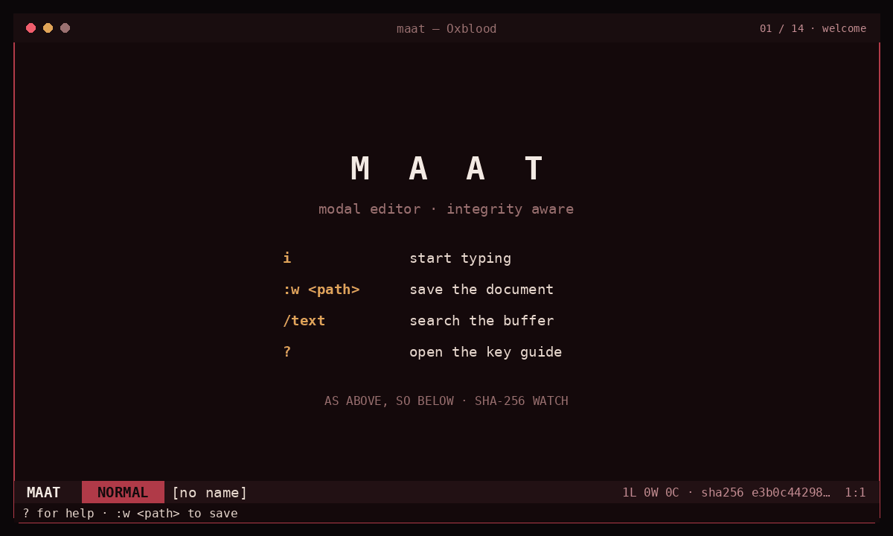
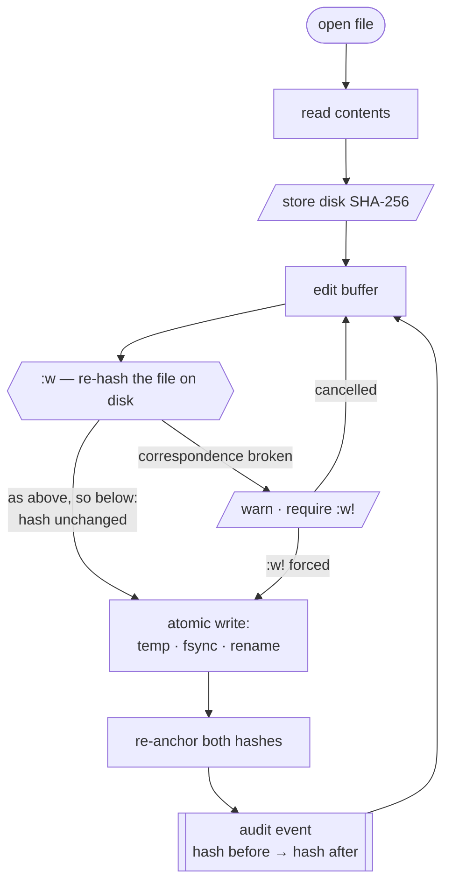
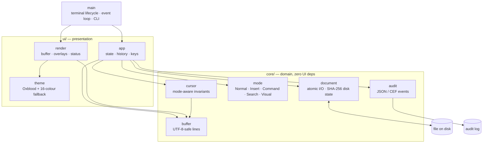

<div align="center">

# MAAT

**A retro modal terminal editor with integrity awareness.**

*As above, so below — the buffer and the disk must agree.*



</div>

## Why Maat?

Maat is a small Vim-inspired editor built with Rust, `ratatui` and
`crossterm`. Its defining feature is **integrity-aware saving**.

When Maat opens a file, it stores a SHA-256 fingerprint of the contents.
Before writing, it checks the file again. If another process changed or deleted
it while the editor was open, Maat warns instead of silently overwriting that
state.

This makes the project especially relevant for shared servers, appliances,
configuration files and security-oriented workflows.

### The name

**Ma'at** is the ancient Egyptian principle of truth and order. Her feather was
weighed against the heart to judge whether a record was true — which is exactly
what this editor does before every write: it weighs what you have against what
is actually on disk.

The tagline comes from the second hermetic principle, Correspondence: *as above,
so below*. The buffer in memory is "above", the file on disk is "below", and an
editor's job is to keep them in correspondence — or to say so loudly when they
stop being.

## Highlights

- Normal, Insert, Command, Search and Visual modes.
- Vim-inspired motions: `hjkl`, `w`, `b`, `0`, `$`, `gg`, `G`, `12G`.
- Counts before any motion or operator: `3j`, `5x`, `2dd`, `3p`.
- Operators compose with motions: `dw`, `c3w`, `d$`, `d0`, `dG`, `dgg`, `yw`.
- Visual selection: `v` character-wise, `V` line-wise, with `d`, `y`, `c`, `p`.
- Literal substitution: `:s/old/new/`, `/g`, and `:%s` for the whole file.
- Incremental `/search`, highlighted matches and `n` / `N` navigation.
- Undo with `u` and redo with `Ctrl-r`.
- Register that remembers whether it holds lines or a character span.
- CRLF and LF line endings preserved exactly as the file had them.
- Bracketed paste: a pasted block is inserted as text, never run as commands.
- System clipboard over **OSC 52** — works through SSH, needs no display server.
- External-change detection before save; explicit `:w!` override.
- Live SHA-256 fingerprint and `:check` integrity command.
- Integrated `?` help panel and a branded welcome screen.
- Absolute or relative line numbers.
- UTF-8-safe editing and horizontal/vertical scrolling.
- **Atomic saves**: a crash mid-write can never leave a half-written file.
- **Audit events** (JSON or CEF) appended on every save, for SIEM ingestion.
- **`--verify`**: non-interactive integrity check for scripts and boot-time use.
- **Exit code 2** on an abandoned edit, so `visudo` and `crontab -e` behave.
- 16-colour fallback for appliance consoles without true colour.
- **Oxblood** visual system: ink, wine and bone — no green-phosphor cliché.

## Quick start

```bash
git clone https://github.com/Zoel-Manchon/maat.git
cd maat
cargo run -- demo/sample.txt
```

Install the binary locally:

```bash
cargo install --path .
maat notes.txt
```

Create a new document without a path:

```bash
maat
```

Then save it from Command mode:

```vim
:w notes/first-draft.txt
```

The destination directory must already exist.

## Key map

### Normal mode

| Keys | Action |
|---|---|
| `h j k l` / arrows | Move cursor |
| `w` / `b` | Next / previous word |
| `0` / `$` | Start / end of line |
| `gg` / `G` | Start / end of buffer |
| `i a I A` | Enter Insert mode |
| `o` / `O` | Open line below / above |
| `x` | Delete character |
| `dd` / `yy` / `cc` | Delete / copy / change the whole line |
| `d` `y` `c` + motion | `dw` `c3w` `d$` `d0` `dG` `dgg` `yw` |
| `p` / `P` | Paste below / above |
| `u` / `Ctrl-r` | Undo / redo |
| `/` | Search |
| `n` / `N` | Next / previous result |
| `?` | Toggle quick reference |
| `:` | Enter Command mode |
| `v` / `V` | Visual mode, character-wise / line-wise |
| `3j` `5x` `2dd` | A count applies to any motion or operator |
| `12G` | Jump to line 12 |

### Visual mode

| Keys | Action |
|---|---|
| `v` / `V` | Start a character-wise / line-wise selection |
| motions | Extend the selection; counts work here too |
| `o` | Jump to the other end of the selection |
| `d` / `x` | Delete the selection (and yank it) |
| `y` | Yank the selection |
| `c` | Delete the selection and enter Insert mode |
| `p` | Replace the selection with the register |
| `Esc` | Leave without touching anything |

### Commands

| Command | Action |
|---|---|
| `:w` | Save |
| `:w <path>` | Save as |
| `:w!` | Force save after an integrity warning |
| `:q` / `:q!` | Quit / discard changes |
| `:wq` / `:x` | Save and quit |
| `:s/old/new/` | Replace the first match on the current line |
| `:s/old/new/g` | Replace every match on the current line |
| `:%s/old/new/g` | Replace every match in the file |
| `:hash` | Show full buffer SHA-256 |
| `:check` | Compare the file with the last known disk state |
| `:info` | Show path, lines, words and characters |
| `:set relativenumber` | Enable relative line numbers |
| `:set number` | Restore absolute line numbers |
| `:set clipboard` | Mirror yanks to the terminal clipboard (OSC 52) |
| `:set noclipboard` | Keep yanks in the editor's register only |
| `:help` | Open the quick reference |

## Command line

```bash
maat FILE              # edit a file
maat                   # start an empty buffer
maat --verify FILE     # print SHA-256 and disk state, then exit
maat --help            # usage
maat --version         # version
```

`--verify` prints in `sha256sum` format so it composes with other tools — an
appliance can call the same binary from a boot script to check a config file
without ever starting a UI:

```console
$ maat --verify /etc/emberwall/gateway.conf
9f2c…  /etc/emberwall/gateway.conf
state: unchanged
```

| Exit code | Meaning |
|---|---|
| `0` | Clean exit |
| `1` | An error occurred |
| `2` | The edit was abandoned with unsaved changes (`:q!`) |

Exit code `2` is what makes Maat safe as `$EDITOR`: `visudo` and `crontab -e`
read it to know they must not install a half-edited file.

## Audit trail

Editing a config file on a hardened host is a security-relevant act. Set
`MAAT_AUDIT_LOG` and every save appends one machine-readable line:

```bash
export MAAT_AUDIT_LOG=/var/log/maat-audit.log
export MAAT_AUDIT_FORMAT=cef        # optional; defaults to json
```

```json
{"tool":"maat","event":"save","ts":1770000000,"user":"zoel","path":"/etc/gateway.conf","lines":42,"sha256_before":"9f2c…","sha256_after":"a41b…"}
```

Both formats match [`phosphor`](https://github.com/Zoel-Manchon/phosphor)'s
exports, so a single collector ingests events from both tools. Audit failures
are silent by design: an unwritable log must never cost you your edit.

## Integrity model



Maat does not claim to be a forensic tool. It provides a focused safety
barrier against accidental blind overwrites and makes external changes visible
at the moment they matter.

## Architecture



Every `core/` module is unit-tested without a terminal: the domain never
imports `ratatui` or `crossterm`.

```text
src/
├── main.rs          terminal lifecycle, event loop, CLI (--verify, --help)
├── core/
│   ├── audit.rs     structured save events (JSON / CEF)
│   ├── buffer.rs    UTF-8-safe line buffer
│   ├── cursor.rs    mode-aware cursor invariants
│   ├── mode.rs      Normal / Insert / Command / Search / Visual
│   └── document.rs  atomic file I/O and SHA-256 disk-state checks
└── ui/
    ├── app.rs       editor state, history, search and key handling
    ├── render.rs    buffer, overlays, welcome and status line
    └── theme.rs     Oxblood palette with 16-colour degradation
```

## Visual identity

The recommended terminal font is **Departure Mono**. Since Maat is a TUI,
the font is selected in the terminal emulator, not by the Rust application.

The **Oxblood** palette and terminal configuration examples are documented in
[`docs/terminal-appearance.md`](docs/terminal-appearance.md).

## Record the demo

The checked-in GIF is a visual walkthrough of the current interface. A
deterministic [VHS](https://github.com/charmbracelet/vhs) tape is also included
for recording a real terminal session:

```bash
./scripts/record-demo.sh            # Linux / macOS / WSL
```

The recording covers the CLI, `--verify`, modal editing, relative numbers,
search, line registers, undo/redo, `:info`, `:hash`, atomic saves, the help
panel and the audit trail.

It also runs a **safe simulated attacker** from `demo/attacker.sh`. The helper
has no network access and exploits nothing: it merely appends one marked line
to the demo fixture while Maat is open. This makes the integrity workflow
visible end to end — `:w` is blocked, `:check` reports the external change,
`:w!` performs a deliberate override, and the save is written to the JSON/CEF
audit trail.

See [`demo/README.md`](demo/README.md) for the exact scenario. VHS needs `ttyd`
and `ffmpeg` on the PATH.

## Development

```bash
cargo fmt --all -- --check
cargo clippy --all-targets --all-features -- -D warnings
cargo test --all-targets --all-features
cargo build --release --locked
```

The CI workflow runs the locked test suite and release build for pushes and
pull requests. Formatting and Clippy remain recommended local pre-commit checks.

## Roadmap

- [x] Retro welcome screen and integrated help.
- [x] Search with highlighted matches.
- [x] Undo/redo and basic line register.
- [x] External-change detection and live SHA-256.
- [x] Atomic cross-platform save replacement.
- [x] Audit events, `--verify` mode and `$EDITOR`-safe exit codes.
- [x] Substitution (`:s`, `:%s`, `/g`) with any delimiter.
- [x] Counts for motions and operations (`3j`, `12G`, `2dd`, `3p`).
- [x] CRLF/LF line endings preserved across a save.
- [x] Bracketed paste, and a terminal that survives a panic.
- [x] Visual mode (`v` / `V`) with character-wise and line-wise operators.
- [ ] Configurable key map, theme and editor options.
- [ ] Syntax highlighting with language detection.
- [ ] Tabs, multiple buffers and a file picker.
- [ ] Rope or piece-table storage for large files.
- [ ] Recovery journal / swap file.
- [ ] Release binaries for Linux, macOS and Windows.

See [`docs/project-review.md`](docs/project-review.md) for the technical review
and design priorities.

## Contributing

Focused issues and pull requests are welcome. Read
[`CONTRIBUTING.md`](CONTRIBUTING.md) before proposing a large feature.

## Emberwall

Maat is designed to ship as the default editor inside an
[Emberwall](https://github.com/Zoel-Manchon/emberwall) appliance image: a static
musl binary, a short dependency tree, and integrity checks that make editing a
config file an auditable act rather than a silent one. See
[`docs/project-review.md`](docs/project-review.md) for the integration path.

## License

MIT © Zoel Arias Manchón